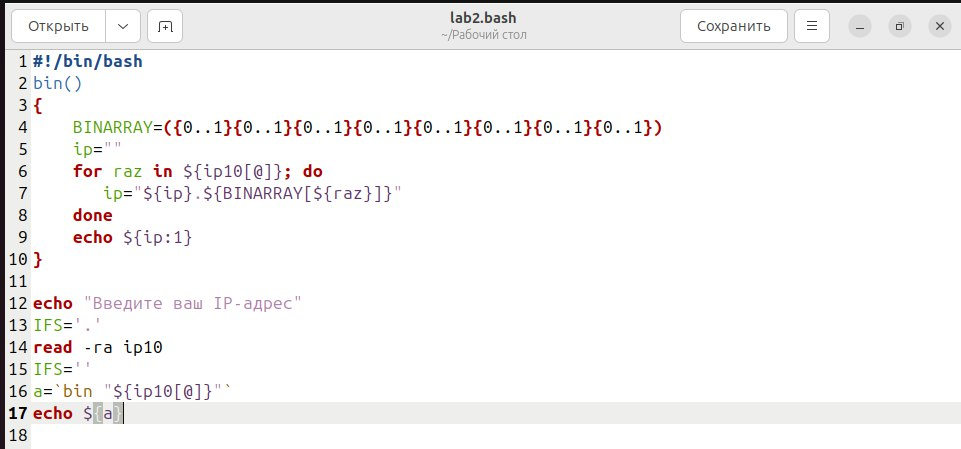
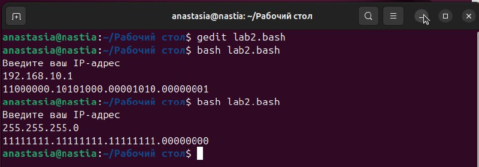

# Панас Анастасия Андреевна, группа K3162, номер ИСУ 467006
В ходе лабораторной работы я написала код программы, которая получает на вход IP-адрес в десятичной системе счисления (мы приняли за данное, что вводимые данные являются верными) и программа переводит данный IP-адрес в двоичную систему и выводит результате

Далее рассмотрим, за что выполняется в некоторых строках кода

1) >IFS='.'

IFS (Input Field Separators), эта переменная хранит внутренние разделители полей, используется для определения того, по какому разделителю выполняется разбиение строки на слова, по умолчанию стоит "разделение по пробелу". В данной строке кода устанавливаю разделителем точку, чтобы разбить входные данные (IP-адрес) на так называемые байты

2) >read -ra ip10

Чтение строки, которая вводится, разделение ее при помощи IFS и сохранение каждого, в нашем случае, байта адреса в массиве ip10

3) >IFS=' '

Возвращаю разделитель на пробел, чтобы в дальнейшем не было проблем с выводом адреса в двоичной системе

4) >bin "${ip10[@]}"

Запускаем функцию bin для каждого эл-та массива, в который мы ссчитали байты IP-адреса в 10 ссчитали. Функция bin() выполняет перевод из 10 сс в 2 сс

5) >BINARRAY=({0..1}{0..1}{0..1}{0..1}{0..1}{0..1}{0..1}{0..1})

Сгенерирован массив из последовательных нулей и единиц, который является двоичным представлением 8 битов IP-адреса, в соответствии с их индексом

6) >ip=""

Создаем пустую строку, в которую в последствии будем добавлять переведенные в двоичную систему байты

7) >for raz in ${ip10[@]}; do

Делаем перебор для каждого разряда( байта из массива с десятичной записью адреса)

>ip=" ${ip}. ${BINNARY[${raz}]}"

Выполняем перевод каждого из байтов при помощи массива _BINNARY_ и добавляем двоичную запись с точкой-разделителем спереди (пример: .11111111)

8) >${ip:1}

Срез строки с двоичной записью(от 1 эл-та), тк первым элементом( с индексом 0) является точка

Проверяем работу кода

